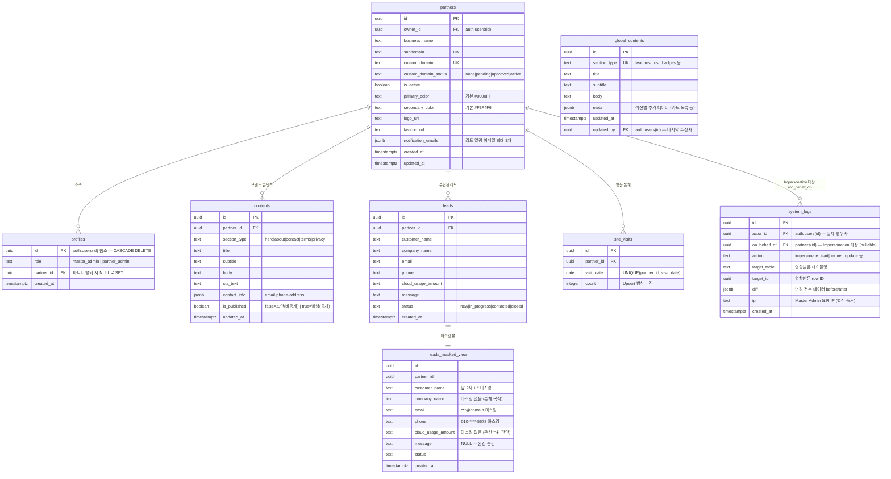

# DB 스키마 설계도

> **최종 업데이트**: 2026-04-08
> **기준 마이그레이션**: `20260408000001` ~ `20260408000004`
> **연관 Confluence 문서**: [3. DB 스키마](https://opsnowinc.atlassian.net/wiki/spaces/WS/pages/289046572) (Page ID: 289046572)
>
> ⚠️ DB 스키마 변경 시 이 문서의 ERD와 테이블 설명을 반드시 함께 업데이트하라. (`CLAUDE.md [5. Design Documentation Sync]` 참조)

---

## ERD (Entity Relationship Diagram)

---

## 테이블 설명

### 1. `partners` — 파트너사 (핵심 테넌트)

멀티테넌트 시스템의 기반. 모든 데이터는 `partner_id`를 통해 이 테이블과 연결된다.

| 컬럼 | 타입 | 설명 |
|------|------|------|
| `owner_id` | UUID FK | 파트너사 오너 계정 (`auth.users` 참조) |
| `business_name` | TEXT | 파트너사 법인명 |
| `subdomain` | TEXT UK | 미들웨어 라우팅 기준 (예: `samsung.opsnow.com`) |
| `custom_domain` | TEXT UK | 파트너 전용 도메인 (예: `cloud.samsung.com`) |
| `custom_domain_status` | TEXT | `none` / `pending` / `approved` / `active` |
| `primary_color` | TEXT | HEX 컬러. CSS Variable `--primary`로 주입 |
| `secondary_color` | TEXT | HEX 컬러. CSS Variable `--secondary`로 주입 |
| `notification_emails` | JSONB | 리드 알림 수신 이메일 목록. **최대 3개** (앱 레벨 검증) |

---

### 2. `profiles` — 사용자 프로필

Supabase `auth.users`와 1:1 연결. `role`로 접근 권한을 구분한다.

| `role` 값 | 설명 |
|-----------|------|
| `master_admin` | OpsNow 내부 관리자. 전 파트너 데이터 접근 가능 (단, leads는 마스킹 뷰 경유 필수) |
| `partner_admin` | 파트너사 담당자. 자사 데이터만 접근 가능 |

> ⚠️ `partner_id`는 파트너사 탈퇴 시 `ON DELETE SET NULL` — 계정은 유지되나 파트너 소속이 해제됨.

---

### 3. `contents` — 파트너별 마케팅 콘텐츠

파트너사가 Admin 대시보드에서 직접 편집하는 섹션별 콘텐츠.

| 컬럼 | 설명 |
|------|------|
| `section_type` | `hero`, `about`, `contact`, `terms`, `privacy`. **(partner_id, section_type) UNIQUE** — 섹션당 1행만 존재 |
| `is_published` | `false`(초안, 비공개) / `true`(발행, 공개). RLS `contents_public_anon_read` 정책으로 미발행 콘텐츠는 마케팅 사이트에 노출되지 않음 |
| `contact_info` | `{"email": "", "phone": "", "address": ""}` 구조의 JSONB |

---

### 4. `global_contents` — 공통 마케팅 콘텐츠

OpsNow Master Admin이 관리하는 전 파트너 공통 콘텐츠. `section_type`이 UNIQUE이므로 섹션당 1행.

| 컬럼 | 설명 |
|------|------|
| `meta` | 섹션별 추가 데이터 (예: 기능 카드 목록 배열, 인증 배지 이미지 URL 등) |
| `updated_by` | 마지막 수정한 Master Admin의 `auth.uid()` — 감사 추적 용도 |

---

### 5. `leads` — 리드 (잠재 고객)

마케팅 사이트 방문자가 제출한 문의/상담 신청 데이터.

| `status` 값 | 설명 |
|-------------|------|
| `new` | 신규 접수 |
| `in_progress` | 검토 중 |
| `contacted` | 연락 완료 |
| `closed` | 종결 |

> **보안**: `master_admin`은 이 테이블에 **직접 접근 불가**. 반드시 `leads_masked_view`를 통해서만 조회.
> **스팸 방지**: `leads_public_insert` RLS 정책이 `is_active = true`인 파트너에만 INSERT 허용. 앱 레벨 Rate Limiting은 WL-30 참조.

---

### 6. `site_visits` — 방문자 통계

파트너별 일별 방문 횟수 집계. `(partner_id, visit_date)` UNIQUE 제약으로 중복 집계 방지.

> ⚠️ INSERT/UPDATE는 **Service Role Key를 사용하는 서버사이드에서만** 수행. RLS INSERT 정책 없음.

---

### 7. `system_logs` — 감사 로그 (Audit Log)

관리자 행위를 추적하는 불변 로그. Impersonation(대리 접속) 포함 모든 관리 작업 기록.

| 컬럼 | 설명 |
|------|------|
| `actor_id` | 실제 행위자 (항상 Master Admin의 `auth.uid()`) |
| `on_behalf_of` | Impersonation 중인 경우 대상 파트너 ID. 일반 작업은 `NULL` |
| `action` | 수행된 작업 (예: `impersonate_start`, `partner_update`, `global_content_publish`) |
| `target_table` | 영향받은 테이블명 |
| `target_id` | 영향받은 row의 UUID |
| `diff` | 변경 전후 데이터: `{"before": {...}, "after": {...}}` |
| `ip` | Master Admin 요청 IP — 법적 증거용 |

> ⚠️ INSERT는 **Service Role Key를 사용하는 서버사이드에서만** 수행. partner_admin은 본인 관련 로그도 조회 불가.

---

### `leads_masked_view` — 리드 마스킹 뷰 (VIEW)

실제 테이블이 아닌 DB View. `master_admin` 전용. 개인정보(PII)를 자동 마스킹하여 반환.

| 컬럼 | 원본 예시 | 마스킹 결과 |
|------|----------|------------|
| `customer_name` | `홍길동` | `홍길*` |
| `email` | `hong@samsung.com` | `***@samsung.com` |
| `phone` | `010-1234-5678` | `010-****-5678` |
| `message` | `상담 내용...` | `NULL` (완전 숨김) |
| `company_name` | 그대로 노출 | 영업 통계 목적 |
| `cloud_usage_amount` | 그대로 노출 | 우선순위 판단 목적 |

> ⚠️ View 자체에 `WHERE EXISTS (master_admin 확인)` 필터 내장 — partner_admin이 조회하면 0건 반환.

---

## RLS 정책 요약

| 테이블 | `anon` | `partner_admin` | `master_admin` | 비고 |
|--------|--------|-----------------|----------------|------|
| `partners` | 활성 파트너 전체 조회 (Fix #1: anon만) | 본인 파트너만 조회 | 전체 CRUD | |
| `profiles` | 없음 | 본인 프로필만 CRUD | 전체 조회 | |
| `contents` | 발행된 콘텐츠만 조회 (Fix #3: anon만) | 자사만 CRUD | 전체 CRUD | |
| `global_contents` | 전체 조회 | 전체 조회 | 전체 CRUD | |
| `leads` | 자사 파트너에 INSERT (is_active 검증) | 자사만 SELECT·UPDATE | **직접 접근 불가** | master_admin은 masked_view 경유 |
| `site_visits` | 없음 | 자사만 조회 | 전체 조회 | Upsert: Service Role Key |
| `system_logs` | 없음 | **없음** | 조회 전용 | INSERT: Service Role Key |

---

## 인덱스 목록 (`20260408000004_indexes.sql`)

| 인덱스명 | 테이블 | 컬럼 | 목적 |
|---------|--------|------|------|
| `idx_partners_subdomain` | partners | subdomain | 미들웨어 도메인 라우팅 |
| `idx_partners_custom_domain` | partners | custom_domain | 미들웨어 도메인 라우팅 |
| `idx_contents_partner_id` | contents | partner_id | 파트너별 콘텐츠 조회 |
| `idx_leads_partner_id` | leads | partner_id | 파트너별 리드 조회 |
| `idx_leads_created_at` | leads | created_at DESC | 최신순 정렬 |
| `idx_leads_status` | leads | status | 상태별 필터링 |
| `idx_global_contents_section_type` | global_contents | section_type | 섹션 직접 조회 |
| `idx_site_visits_partner_date` | site_visits | (partner_id, visit_date DESC) | 날짜별 방문 집계 |
| `idx_system_logs_actor_id` | system_logs | actor_id | 행위자 기준 감사 |
| `idx_system_logs_on_behalf_of` | system_logs | on_behalf_of | Impersonation 대상 기준 감사 |
| `idx_system_logs_created_at` | system_logs | created_at DESC | 시간순 감사 로그 |
