# DB 스키마 설계도

> **최종 업데이트**: 2026-04-14
> **기준 마이그레이션**: `20260408000001` ~ `20260408000004`, WL-62 (2026-04-12), WL-65 (2026-04-14)
> **연관 Confluence 문서**: [3. DB 스키마](https://opsnowinc.atlassian.net/wiki/spaces/WS/pages/289046572) (Page ID: 289046572)
>
> ⚠️ DB 스키마 변경 시 이 문서의 ERD와 테이블 설명을 반드시 함께 업데이트하라. (`CLAUDE.md [5. Design Documentation Sync]` 참조)

---

## ERD (Entity Relationship Diagram)

```mermaid
erDiagram
    partners {
        uuid id PK
        uuid owner_id FK "auth.users(id)"
        text business_name
        text subdomain UK
        text custom_domain UK
        text custom_domain_status "none|pending|approved|active (TEXT + CHECK 제약)"
        boolean is_active
        text theme_key "gray|blue|green|orange DEFAULT 'blue'"
        text default_locale "ko|en DEFAULT 'ko'"
        text published_locales "ARRAY — 발행된 언어 목록"
        text logo_url
        text favicon_url
        jsonb notification_emails "리드 알림 이메일 최대 3개"
        timestamptz created_at
        timestamptz updated_at
    }

    profiles {
        uuid id PK "auth.users(id) 참조 — CASCADE DELETE"
        text role "master_admin | partner_admin"
        uuid partner_id FK "파트너 탈퇴 시 NULL로 SET"
        timestamptz created_at
    }

    contents {
        uuid id PK
        uuid partner_id FK
        text section_type "marketing 8 + legacy 2 + legal 3 — src/types/section-type.ts 참조"
        text title
        text subtitle
        text body
        text cta_text
        jsonb contact_info "email·phone·address"
        boolean is_published "false=초안(비공개) | true=발행(공개)"
        timestamptz updated_at
    }

    global_contents {
        uuid id PK
        text section_type UK "features|trust_badges 등"
        text title
        text subtitle
        text body
        jsonb meta "섹션별 추가 데이터 (카드 목록 등)"
        timestamptz updated_at
        uuid updated_by FK "auth.users(id) — 마지막 수정자"
    }

    leads {
        uuid id PK
        uuid partner_id FK
        text customer_name
        text company_name
        text email
        text phone
        text cloud_usage_amount
        text message
        text status "new|in_progress|contacted|closed"
        timestamptz created_at
    }

    site_visits {
        uuid id PK
        uuid partner_id FK
        date visit_date "UNIQUE(partner_id, visit_date)"
        integer count "Upsert 방식 누적"
    }

    system_logs {
        uuid id PK
        uuid actor_id FK "auth.users(id) — 실제 행위자"
        uuid on_behalf_of FK "partners(id) — Impersonation 대상 (nullable)"
        uuid partner_id FK "partners(id) — 감사 대상 파트너 (NFR §5.3, nullable, WL-123)"
        text action "impersonate_start|partner_update 등"
        text target_table "영향받은 테이블명"
        uuid target_id "영향받은 row ID"
        jsonb diff "변경 전후 데이터 before/after"
        text ip "Master Admin 요청 IP (법적 증거)"
        timestamptz created_at
    }

    domain_requests {
        uuid id PK
        uuid partner_id FK "partners(id) CASCADE DELETE"
        text requested_domain
        text request_type "subdomain|custom_tld"
        domain_request_status status "pending|approved|active|rejected|expired (ENUM)"
        jsonb verification_record
        text rejection_reason
        timestamptz created_at
        timestamptz updated_at
        timestamptz reviewed_at
        timestamptz activated_at
    }

    leads_masked_view {
        uuid id
        uuid partner_id
        text customer_name "앞 2자 + * 마스킹"
        text company_name "마스킹 없음 (통계 목적)"
        text email "***@domain 마스킹"
        text phone "010-****-5678 마스킹"
        text cloud_usage_amount "마스킹 없음 (우선순위 판단)"
        text message "NULL — 완전 숨김"
        text status
        timestamptz created_at
    }

    partner_sections {
        uuid id PK
        uuid partner_id FK
        text section_type "pain_points|stats|how_it_works|finops_automation|core_engines|role_based_value|faq|final_cta (CHECK 제약)"
        boolean is_visible "true=노출 / false=숨김 (anon RLS가 false 행 필터링)"
        integer display_order "렌더링 순서 (ASC)"
        timestamptz created_at
        timestamptz updated_at
    }

    partners ||--o{ profiles : "소속"
    partners ||--o{ contents : "브랜드 콘텐츠"
    partners ||--o{ partner_sections : "섹션 노출 제어"
    partners ||--o{ leads : "수집된 리드"
    partners ||--o{ site_visits : "방문 통계"
    partners ||--o{ system_logs : "Impersonation 대상 (on_behalf_of) + 감사 대상 (partner_id, WL-123)"
    partners ||--o{ domain_requests : "커스텀 도메인 신청 이력"
    leads ||--|| leads_masked_view : "마스킹 뷰"
```



---

## 테이블 설명

### 1. `partners` — 파트너사 (핵심 테넌트)

멀티테넌트 시스템의 기반. 모든 데이터는 `partner_id`를 통해 이 테이블과 연결된다.

| 컬럼 | 타입 | 설명 |
|------|------|------|
| `owner_id` | UUID FK | 파트너사 오너 계정 (`auth.users` 참조) |
| `business_name` | TEXT | 파트너사 법인명 |
| `subdomain` | TEXT UK | 미들웨어 라우팅 기준 (예: `samsung.opsnow.com`) |
| `custom_domain` | TEXT UK | 파트너 전용 도메인 (예: `cloud.samsung.com`) |
| `custom_domain_status` | TEXT | `none` / `pending` / `approved` / `active` — CHECK 제약으로 허용 값 강제. 기존 RLS/함수 호환성을 위해 TEXT 타입 유지 |
| `theme_key` | TEXT | 파트너 테마 식별자. `src/lib/theme-presets.ts`의 19개 CSS 변수로 확장. DEFAULT `'blue'` |
| `default_locale` | TEXT | 로케일 감지 실패 시 폴백. `'ko'` \| `'en'`. DEFAULT `'ko'` |
| `published_locales` | TEXT[] | 실제 발행된 언어 목록. 미발행 언어 접근 시 `default_locale`로 soft-landing. DEFAULT `ARRAY['ko']` |
| `notification_emails` | JSONB | 리드 알림 수신 이메일 목록. **최대 3개** (앱 레벨 검증) |

**테마 프리셋 4종** (`src/lib/theme-presets.ts` → `themes[theme_key]` 참조):

| `theme_key` | 대표 hex | 용도 |
|-------------|---------|------|
| `gray`      | `#0D0C22` | 중립적·전문적 이미지 |
| `blue`      | `#0012B6` | 신뢰·기술 이미지 (기본값) |
| `green`     | `#1A5835` | 성장·친환경 이미지 |
| `orange`    | `#D23F01` | 에너지·혁신 이미지 |

> `layout.tsx`에서 `themes[theme_key]` 맵을 조회해 CSS Variables 19개를 `<div style={}>` 인라인 주입.
> 어드민 UI는 위 4종만 선택지로 제공한다.

---

### 2. `profiles` — 사용자 프로필

Supabase `auth.users`와 1:1 연결. `role`로 접근 권한을 구분한다.

| `role` 값 | 설명 |
|-----------|------|
| `master_admin` | OpsNow 내부 관리자. 전 파트너 데이터 접근 가능 (단, leads는 마스킹 뷰 경유 필수) |
| `partner_admin` | 파트너사 담당자. 자사 데이터만 접근 가능 |

> ⚠️ `partner_id`는 파트너사 탈퇴 시 `ON DELETE SET NULL` — 계정은 유지되나 파트너 소속이 해제됨.

---

### 3. `contents` — 파트너별 마케팅 콘텐츠

파트너사가 Admin 대시보드에서 직접 편집하는 섹션별 콘텐츠.

| 컬럼 | 설명 |
|------|------|
| `section_type` | **Marketing (8)**: `pain_points` `stats` `how_it_works` `finops_automation` `core_engines` `role_based_value` `faq` `final_cta` / **Legacy (2)**: `hero` `footer` / **Legal (3)**: `terms` `privacy` `cookie_policy`. **(partner_id, section_type) UNIQUE** — 섹션당 1행만 존재. 정전 타입: `src/types/section-type.ts` |
| `body` | 텍스트 섹션은 i18n 문자열 / 배열 섹션(`stats`, `how_it_works`, `faq`)은 JSONB 배열 |
| `is_published` | `false`(초안, 비공개) / `true`(발행, 공개). RLS `contents_public_anon_read` 정책으로 미발행 콘텐츠는 마케팅 사이트에 노출되지 않음 |
| `contact_info` | `{"email": "", "phone": "", "address": ""}` 구조의 JSONB |

---

### 3-b. `partner_sections` — 파트너별 섹션 노출 제어 (WL-40 신규)

파트너가 마케팅 사이트에 표시할 섹션을 ON/OFF하고 순서를 지정하는 테이블.

| 컬럼 | 설명 |
|------|------|
| `section_type` | 토글 가능한 섹션 목록 (CHECK 제약). 고정 섹션(hero, footer, contact)은 미포함 |
| `is_visible` | `false`이면 마케팅 사이트에서 숨김. anon RLS가 `is_visible=true` 행만 반환 |
| `display_order` | 오름차순 정렬. DB rows가 없는 신규 파트너는 앱 레벨 DEFAULT_SECTIONS 폴백 적용 |

---

### 4. `global_contents` — 공통 마케팅 콘텐츠

OpsNow Master Admin이 관리하는 전 파트너 공통 콘텐츠. `section_type`이 UNIQUE이므로 섹션당 1행.

| 컬럼 | 설명 |
|------|------|
| `meta` | 섹션별 추가 데이터 (예: 기능 카드 목록 배열, 인증 배지 이미지 URL 등) |
| `updated_by` | 마지막 수정한 Master Admin의 `auth.uid()` — 감사 추적 용도 |

---

### 5. `leads` — 리드 (잠재 고객)

마케팅 사이트 방문자가 제출한 문의/상담 신청 데이터.

| `status` 값 | 설명 |
|-------------|------|
| `new` | 신규 접수 |
| `in_progress` | 검토 중 |
| `contacted` | 연락 완료 |
| `closed` | 종결 |

> **보안**: `master_admin`은 이 테이블에 **직접 접근 불가**. 반드시 `leads_masked_view`를 통해서만 조회.
> **스팸 방지**: `leads_public_insert` RLS 정책이 `is_active = true`인 파트너에만 INSERT 허용. 앱 레벨 Rate Limiting은 WL-30 참조.

---

### 6. `site_visits` — 방문자 통계

파트너별 일별 방문 횟수 집계. `(partner_id, visit_date)` UNIQUE 제약으로 중복 집계 방지.

> ⚠️ INSERT/UPDATE는 **Service Role Key를 사용하는 서버사이드에서만** 수행. RLS INSERT 정책 없음.

---

### 7. `system_logs` — 감사 로그 (Audit Log)

관리자 행위를 추적하는 불변 로그. Impersonation(대리 접속) 포함 모든 관리 작업 기록.

| 컬럼 | 설명 |
|------|------|
| `actor_id` | 실제 행위자 (항상 Master Admin의 `auth.uid()`) |
| `on_behalf_of` | Impersonation 중인 경우 대상 파트너 ID. 일반 작업은 `NULL` |
| `partner_id` | 감사 대상 파트너 ID (WL-123, NFR §5.3). 파트너-스코프 테이블 작업 시 자동 주입. 글로벌 작업은 `NULL`. `JOIN partners` 없이 파트너별 직접 필터링 가능 |
| `action` | 수행된 작업 (예: `impersonate_start`, `partner_update`, `global_content_publish`) |
| `target_table` | 영향받은 테이블명 |
| `target_id` | 영향받은 row의 UUID |
| `diff` | 변경 전후 데이터: `{"before": {...}, "after": {...}}` |
| `ip` | Master Admin 요청 IP — 법적 증거용 |

> ⚠️ INSERT는 **Service Role Key를 사용하는 서버사이드에서만** 수행.
> `partner_admin`은 WL-121 이후 자기 파트너 관련 로그(`on_behalf_of` 매칭) SELECT 가능. WL-123 이후 `partner_id` 매칭도 병행 허용 — 단 `PARTNER_SCOPED_TABLES` 화이트리스트 테이블 작업만 기록됨.
>
> **PARTNER_SCOPED_TABLES 화이트리스트 (WL-123, Default Deny)**:
> `partners`, `contents`, `partner_sections`, `leads`, `site_visits`, `domain_requests`

---

### 8. `domain_requests` — 커스텀 도메인 신청 이력 (WL-62, 2026-04-12)

파트너가 신청한 커스텀 도메인의 생애주기를 이력으로 관리하는 테이블.
`partners` 테이블의 현재 활성 상태(`custom_domain`, `custom_domain_status`)와 분리되어 여러 신청 이력을 누적 저장한다.

| 컬럼 | 타입 | 설명 |
|------|------|------|
| `partner_id` | UUID FK | 신청 파트너 (`partners.id` 참조, CASCADE DELETE) |
| `requested_domain` | TEXT | 신청된 도메인 (예: `cloud.partner-a.com`) |
| `request_type` | TEXT | `subdomain` (*.opsnow.com) / `custom_tld` (외부 도메인) |
| `status` | ENUM | `pending` → `approved` → `active` / `rejected` / `expired` |
| `verification_record` | JSONB | DNS 검증 레코드 `{"type": "CNAME", "target": "...", "verified": bool}` |
| `rejection_reason` | TEXT | 거절 사유 (nullable) |
| `reviewed_at` | TIMESTAMPTZ | 승인/거절 시각 — 트리거 자동 기록 |
| `activated_at` | TIMESTAMPTZ | `active` 전환 시각 — 트리거 자동 기록 |

**상태 전이:**
```
pending → approved → active   (성공 경로)
pending → rejected             (거절)
approved → expired             (DNS 검증 타임아웃)
```

**Sync Protocol**: `active` 전환 시 트리거(`trg_sync_domain_to_partner`)가 `partners.custom_domain` + `partners.custom_domain_status`를 원자 업데이트. `proxy.ts`는 `partners` 테이블을 직접 조회하므로 별도 캐시 무효화 불필요.

**Partial Unique Index** (`unique_active_request_per_partner`): `status IN ('pending', 'approved', 'active')` 조건으로 진행 중 신청은 파트너당 1개만 허용. `rejected`/`expired` 이력은 무제한 누적 가능.

---

### `leads_masked_view` — 리드 마스킹 뷰 (VIEW)

실제 테이블이 아닌 DB View. `master_admin` 전용. 개인정보(PII)를 자동 마스킹하여 반환.

| 컬럼 | 원본 예시 | 마스킹 결과 |
|------|----------|------------|
| `customer_name` | `홍길동` | `홍길*` |
| `email` | `hong@samsung.com` | `***@samsung.com` |
| `phone` | `010-1234-5678` | `010-****-5678` |
| `message` | `상담 내용...` | `NULL` (완전 숨김) |
| `company_name` | 그대로 노출 | 영업 통계 목적 |
| `cloud_usage_amount` | 그대로 노출 | 우선순위 판단 목적 |

> ⚠️ View 자체에 `WHERE EXISTS (master_admin 확인)` 필터 내장 — partner_admin이 조회하면 0건 반환.

---

## RLS 정책 요약

| 테이블 | `anon` | `partner_admin` | `master_admin` | 비고 |
|--------|--------|-----------------|----------------|------|
| `partners` | 활성 파트너 전체 조회 (Fix #1: anon만) | 본인 파트너만 조회 | 전체 CRUD | |
| `profiles` | 없음 | 본인 프로필만 CRUD | 전체 조회 | |
| `contents` | 발행된 콘텐츠만 조회 (Fix #3: anon만) | 자사만 CRUD | 전체 CRUD | |
| `global_contents` | 전체 조회 | 전체 조회 | 전체 CRUD | |
| `leads` | 자사 파트너에 INSERT (is_active 검증) | 자사만 SELECT·UPDATE | **직접 접근 불가** | master_admin은 masked_view 경유 |
| `site_visits` | 없음 | 자사만 조회 | 전체 조회 | Upsert: Service Role Key |
| `system_logs` | 없음 | 자기 파트너 관련 로그만 SELECT (`partner_id` OR `on_behalf_of` 매칭 — WL-121+WL-123) | 조회 전용 | INSERT: Service Role Key. `partner_id` 자동 주입은 PARTNER_SCOPED_TABLES 화이트리스트 한정 |
| `domain_requests` | 없음 | 자사 요청만 SELECT·INSERT | 전체 CRUD | 트리거가 active 전환 시 partners 원자 업데이트 |

---

## 인덱스 목록

| 인덱스명 | 테이블 | 컬럼 | 목적 |
|---------|--------|------|------|
| `idx_partners_subdomain` | partners | subdomain | 미들웨어 도메인 라우팅 |
| `idx_partners_custom_domain` | partners | custom_domain | 미들웨어 도메인 라우팅 |
| `idx_contents_partner_id` | contents | partner_id | 파트너별 콘텐츠 조회 |
| `idx_leads_partner_id` | leads | partner_id | 파트너별 리드 조회 |
| `idx_leads_created_at` | leads | created_at DESC | 최신순 정렬 |
| `idx_leads_status` | leads | status | 상태별 필터링 |
| `idx_global_contents_section_type` | global_contents | section_type | 섹션 직접 조회 |
| `idx_site_visits_partner_date` | site_visits | (partner_id, visit_date DESC) | 날짜별 방문 집계 |
| `idx_system_logs_actor_id` | system_logs | actor_id | 행위자 기준 감사 |
| `idx_system_logs_on_behalf_of` | system_logs | on_behalf_of | Impersonation 대상 기준 감사 |
| `idx_system_logs_partner_id` | system_logs | partner_id (WHERE NOT NULL) | 파트너별 직접 감사 필터링 (WL-123, NFR §5.3) |
| `idx_system_logs_created_at` | system_logs | created_at DESC | 시간순 감사 로그 |
| `unique_active_request_per_partner` | domain_requests | partner_id (WHERE status IN 'pending','approved','active') | 진행 중 도메인 신청 중복 방지 |
| `idx_leads_partner_status_created` | leads | (partner_id, status, created_at DESC) | Admin 파트너별 리드 목록 + 상태 필터 + 최신순 (WL-120) |
| `idx_contents_partner_section_published` | contents | (partner_id, section_type, is_published) | Admin 파트너별 섹션 목록 + 타입/발행 필터 (WL-120) |
| `idx_system_logs_partner_created` | system_logs | (partner_id, created_at DESC) WHERE NOT NULL | Admin 파트너별 감사 로그 + 최신순 정렬 (WL-120) |
| `idx_domain_requests_partner_status_created` | domain_requests | (partner_id, status, created_at DESC) | Admin 파트너별 도메인 신청 + 상태 필터 + 최신순 (WL-120) |

### Index Notes (WL-120, 2026-04-19)

> **쿼리 플래너 동작**: 복합 인덱스는 데이터 행 수가 수백 행 이상일 때 플래너가 자동으로 Index Scan을 선택한다. 소량 데이터(수십 행 이하)에서는 Seq Scan이 비용상 우세할 수 있으며 이는 정상 동작이다.
>
> **쓰기 부하 모니터링**: `system_logs`는 모든 Admin 작업마다 INSERT가 발생하므로 파트너 수 급증 및 이벤트 빈도 증가 시 인덱스 유지비용을 모니터링할 것. 필요 시 `idx_system_logs_partner_created` 삭제 후 기존 `idx_system_logs_partner_id` 단독으로 복귀 가능.
>
> **CONCURRENTLY 적용**: `supabase migration up`은 pipeline 모드로 CONCURRENTLY 불가. 프로덕션 무중단 인덱스 생성이 필요한 경우 SQL Editor에서 `CREATE INDEX CONCURRENTLY` 수동 실행.

---

## JSONB 컬럼 스키마 명세 (Admin 타입 계약)

> **목적**: Admin 편집 폼의 Zod 스키마 및 Server Action 입력 검증과 1:1 매칭되는 JSONB 내부 구조 명세.
> **출처**: `src/lib/marketing/parsers.ts`, `supabase/migrations/20260415000001_normalize_partner_content.sql`, 파트너 seed 파일.
> **원칙**: 이 섹션을 SSOT로 삼아 `src/types/*`의 Zod/TS 타입과 동기화한다. JSONB 구조 추가·변경 시 이 섹션을 먼저 업데이트한 뒤 구현한다.

### i18n 공통 래퍼

Marketing 콘텐츠의 다국어 문자열은 아래 래퍼로 저장된다. 로케일 폴백은 `extractI18n(value, locale)` → 누락 시 `partners.default_locale`로 soft-landing (`src/lib/marketing/get-partner-page-data.ts`).

```ts
type I18nString = { ko: string; en: string; ja?: string; zh?: string }
```

### `contents.body` — section_type별 body 스키마

> ⚠️ ERD 및 §3 테이블 설명의 `section_type` 목록(5~8종)은 실제 13종(아래)보다 축약되어 있다. 별도 티켓으로 ERD·컬럼 설명 동기화 예정 (Anti-Fragmentation §11.2 — 본 작업 범위에서는 이 명세 섹션만 추가).

| `section_type` | `body` 타입 | 설명 |
|----------------|-------------|------|
| `hero` | `I18nString \| null` | 메인 카피 |
| `pain_points` | `null` | `global_contents.meta.cards` 사용, partner row는 title/subtitle만 편집 |
| `stats` | `StatItem[]` | 아래 참조 |
| `how_it_works` | `StepItem[]` | 아래 참조 |
| `finops_automation` | `null` | global meta 사용, title/subtitle만 편집 |
| `core_engines` | `null` | 동일 |
| `role_based_value` | `null` | 동일 |
| `faq` | `FaqItem[]` | 아래 참조 |
| `final_cta` | `I18nString \| null` | CTA 카피 |
| `footer` | `null` | `is_published`만 사용 |
| `about` | `I18nString \| null` | 장문 본문 |
| `contact` | `null` | `contact_info` 컬럼 별도 사용 |
| `terms` / `privacy` / `cookie_policy` | `I18nString \| null` | 법적 문서 본문 |

**배열 아이템 정의:**

```ts
interface StatItem {
  value: string;             // "30%"
  unit: I18nString;          // {ko:"평균", en:"avg"}
  label: I18nString;
  detail: I18nString;
}

interface StepItem {
  step: number;              // 1부터
  title: string;             // 비i18n 영문 태그
  subtitle: I18nString;
  description: I18nString;
  details: I18nString[];     // 불릿 리스트
  iconName: string;          // lucide-react 아이콘명
}

interface FaqItem {
  question: I18nString;
  answer: I18nString;
  category?: string;
}
```

### `contents.contact_info`

```ts
interface ContactInfo {
  email: string;
  phone: string;
  address: string;
  corporate_info?: {
    company_name: string;
    representative: string;
    registration_number: string;
  };
  social_links?: Array<{ platform: string; url: string }>;
}
```

### `global_contents.meta` — section_type별 meta 스키마

| `section_type` | `meta` 구조 |
|----------------|-------------|
| `pain_points` | `{ cards: Array<{ icon, title, description, tag, pain }> }` |
| `finops_automation` | `{ features: Array<{ title, subtitle, description }> }` |
| `core_engines` | `{ engines: Array<{ name, description, icon }> }` |
| `role_based_value` | `{ roles: Array<{ role, title, description, metrics: string[] }> }` |

내부 문자열은 파서가 i18n 래퍼/단일 문자열 둘 다 허용 (`src/lib/marketing/parsers.ts`의 `extractI18n`).

### `system_logs.diff`

```ts
interface AuditDiff {
  before: Record<string, unknown> | null;  // INSERT 시 null
  after: Record<string, unknown> | null;   // DELETE 시 null
}
```

**action별 기대 diff (Admin 착수 시 실제 값 반영):**

| `action` | diff 내용 | 비고 |
|---------|----------|------|
| `partner_update` | 변경 컬럼의 before/after (theme_key, custom_domain 등) | |
| `content_publish` | `before:{is_published:false}, after:{is_published:true}` | |
| `impersonate_start` | `before:null, after:{target_partner_id}` | `target_id = partners.id` |
| `lead_status_change` | 상태 전이만 (`new` → `contacted`) | **PII 절대 포함 금지** |

> ⚠️ **PII 격리 원칙**: `leads` 변경 로그는 `email`·`phone`·`customer_name`·`message` 원본을 diff에 담지 않는다. 상태 전이 및 ID만 기록한다.

### `partners.notification_emails`

```ts
type NotificationEmails = string[];  // 최대 3개, 앱 레벨 검증
```

### `domain_requests.verification_record`

```ts
interface VerificationRecord {
  type: "CNAME" | "TXT" | "A";
  target: string;
  verified: boolean;
}
```

> ⚠️ **SSOT 불일치 경고 (§11.2 보고)**: `domain_requests` 테이블은 본 문서 §8 및 WL-62 기록상 존재하나 `supabase/migrations/` 로컬 디렉토리에 DDL이 없다. Cloud SQL Editor로 적용되었을 가능성이 높다. Admin 구현 전 로컬 마이그레이션으로 역구성(reverse-capture)하여 SSOT 일치를 맞출 것. 이 작업은 별도 티켓.

---

## Foreign Key 정책 맵

> **PostgreSQL 기본값**: `ON DELETE`/`ON UPDATE` 미지정 시 `NO ACTION` — 참조 무결성 위반 시 트랜잭션 실패. UUID는 불변이므로 `ON UPDATE`는 전 테이블 `NO ACTION`으로 공백 처리된다.
> **출처**: `supabase/migrations/20260408000001_create_tables.sql` 및 후속 ALTER 없음.

| Table.Column | References | ON DELETE | 삭제 시 영향 |
|--------------|-----------|-----------|-------------|
| `partners.owner_id` | `auth.users(id)` | **NO ACTION** | 오너 계정 삭제 불가(고아 방지) |
| `profiles.id` | `auth.users(id)` | **CASCADE** | auth 사용자 삭제 시 프로필 자동 삭제 |
| `profiles.partner_id` | `partners(id)` | **SET NULL** | 파트너 탈퇴 시 프로필은 유지, 소속만 해제 |
| `contents.partner_id` | `partners(id)` | **CASCADE** | 파트너 삭제 시 콘텐츠 전부 소멸 |
| `partner_sections.partner_id` | `partners(id)` | **CASCADE** | 동일 |
| `leads.partner_id` | `partners(id)` | **CASCADE** | ⚠️ 리드(PII) 함께 소멸 — 법적 보관 의무 재검토 대상 |
| `site_visits.partner_id` | `partners(id)` | **CASCADE** | 통계도 함께 소멸 |
| `system_logs.actor_id` | `auth.users(id)` | **NO ACTION** | ⚠️ 감사 로그 불변성 — actor 계정 삭제 불가 |
| `system_logs.on_behalf_of` | `partners(id)` | **NO ACTION** | ⚠️ 감사 로그 대상 파트너 삭제 불가 |
| `system_logs.partner_id` (WL-123) | `partners(id)` | **NO ACTION** | ⚠️ `on_behalf_of`와 동일 불변성. 파트너 hard-delete 요구 시 두 FK 동시 재검토 필요 |
| `global_contents.updated_by` | `auth.users(id)` | **NO ACTION** | 수정자 계정 삭제 불가 |
| `domain_requests.partner_id` | `partners(id)` | **CASCADE** | (로컬 마이그레이션 부재 — 위 §경고 참조) |

### Admin "파트너 삭제" 기능 구현 시 사전 점검

1. `system_logs.on_behalf_of` NO ACTION이 파트너 삭제 트랜잭션을 차단한다. 정책 재설계 필요 — 예: `SET NULL`로 변경하고 `diff.before`에 파트너 스냅샷을 저장해 감사 추적성을 유지.
2. `leads.partner_id` CASCADE로 리드가 함께 소멸한다. 개인정보 보관 의무(예: 세무·통신판매 관련)가 있다면 **soft delete** 전환 필요.
3. 파트너 삭제는 Critical 트랙으로 분류하고 Auditor Digest 필수.

---

## Views · Functions · Triggers (현황 + Admin 설계 초안)

### 현재 DB에 존재하는 오브젝트

| 오브젝트 | 종류 | 정의 위치 | 목적 |
|---------|------|----------|------|
| `leads_masked_view` | VIEW | `20260408000002_create_views.sql` | `master_admin` 전용 PII 마스킹 조회 (WHERE EXISTS로 역할 검증 내장) |
| `get_my_role()` | FUNCTION | `20260408000003_rls_policies.sql` | RLS recursion 회피용 역할 조회. `SECURITY DEFINER`, `search_path=public` |
| `fn_init_partner_defaults()` | FUNCTION | `20260415000002_add_partner_init_trigger.sql` | 파트너 INSERT 시 `partner_sections` 8행 + `contents` 11행(마케팅 8 + 법적 3) 자동 시딩. `SECURITY DEFINER`, `REVOKE EXECUTE FROM PUBLIC` |
| `trg_init_partner_defaults` | TRIGGER | `20260415000002_add_partner_init_trigger.sql` | `AFTER INSERT ON partners` → `fn_init_partner_defaults()` 호출 |

### Admin 대시보드·운영을 위한 집계 오브젝트 초안 (제안)

Admin 리스트/대시보드를 App 레이어 loop로 구현하면 N+1 쿼리가 발생한다. 각 Admin 기능 티켓 착수 시 아래를 마이그레이션으로 생성한다.

| 이름(제안) | 종류 | 목적 | 접근 제어 |
|-----------|------|------|----------|
| `v_partner_overview` | VIEW | 파트너 리스트 + 리드 수 + 최근 7일 방문 + 최종 수정 시각 | RLS: master=전체, partner_admin=자사만 |
| `v_lead_dashboard` | VIEW | 월별·상태별 리드 집계 (PII 제외, 통계 필드만) | master / partner_admin 각자 자사 기준 |
| `v_audit_monthly` | VIEW | `system_logs` 월별·action별 집계 | `master_admin` 전용 |
| `fn_partner_metrics(p_partner_id uuid)` | FUNCTION | 단일 파트너 KPI(리드·방문·발행률) | `SECURITY INVOKER` — RLS 준수 |
| `fn_log_admin_action(action, target_table, target_id, diff, on_behalf_of)` | FUNCTION | Server Action 7단계 체크체인 중 6단계(감사 로그) 공용 헬퍼. service_role 키 노출 없이 Server Action에서 호출 | `SECURITY DEFINER` + 호출자 역할 재검증 |

> ⚠️ 위 오브젝트는 **설계 초안**이며 실제 생성은 각 Admin 기능 티켓에서 `/migration-safe` 체크 → High·Critical 트랙 Human Check 승인 후 마이그레이션 파일로 추가한다.
